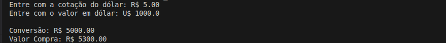

# Conversor de Moedas Simples

Programa para calcular o valor total em reais na compra de dólares, considerando a cotação atual e a incidência de IOF.

## Detalhes Gerais

- **Versão**: 0.1
- **Conceito aplicado:** Membros Estáticos

## Descrição da Tag

Implementacao inicial do problema Conversor de Moeda utilizando orientacao a objetos.

A solucao foi estruturada com uma classe estatica Conversor, contendo metodos estaticos para conversao cambial e aplicacao de imposto IOF. O fluxo do programa foi organizado na classe ProgramExamples, separando regra de negocio da execucao principal.

## Exemplo de Execução

